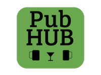
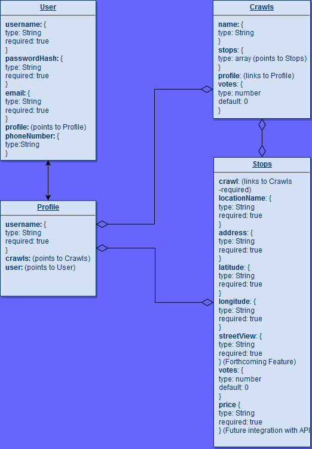
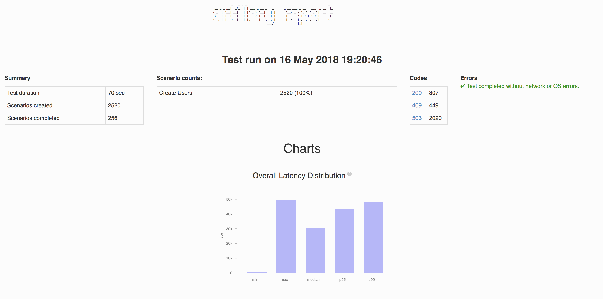

# Pub Hub

 

# Overview

This is a back-end application that generates a pub crawl, including user authentication, persistence of data via MongoDB, and route optimization via GraphHopper API. It uses the Google Places API to populate stops and stores/retrieves data via Mongoose middleware to the database. The application utilizes an Express server built with Node.js, middleware and a SMS send and retrieve feature via a Twilio API. 

## Getting Started

The PubHub API is available at `https://pub-hub.herokuapp.com`.

- [Using PubHub](#using-pubhub)
- [Schemas](#schema-structure)
    - [User Schema](#user-schema)
        - [Sign up](#post-/signup)
        - [Log in](#get-/login)
    - [Profile Schema](#profile-schema)
        - [See all user profiles](#get-/profiles)
    - [Crawls Schema](#crawls-schema)
        - [Get all crawls in database](#get-/crawls)
        - [Get all crawls by username](#get-/crawls/\<username>)
        - [Get one crawl by username](#get-/crawls/\<username>/\<crawl-id>)
        - [Get total votes by crawl](#get-/crawls/votes/\<crawl-id>)
        - [Add a vote to a crawl](#put-/crawls/votes/\<crawl-id>)
        - [Add a crawl to a user's profile](#put-/crawls/\<username>/\<crawl-id>/\<route-name>)
        - [Delete a crawl](#delete-/crawls/\<crawl-id>)
    - [Stops Schema](#stops-schema)
        - [Add a vote to a stop](#put-/stops/votes/\<stop-id>)
        - [Get total votes by stop](#get-/stops/votes/\<stop-id>)
        - [Delete a stop from a route](#delete-/stops/\<stop-id>)
- [Architecture](#architecture)
- [Testing](#testing)
- [Meet the Team](#meet-the-team)
- [Credits and Collaborations](#credits-and-collaborations)

## Using PubHub

To generate a Pub crawl, make a GET request to the following link (with parameters filled in with desired information)

        https://pub-hub.herokuapp.com/search/<latitude>/<longitude>/<price-range>/<max-stops>

- *The price range must be a number between 0-4*
- *PubHub supports between 3-6 stops*

This will return an array of objects holding the names and addresses of the generated pub crawl:
 
     [
        { "name": "Bandits Bar",
          "address": "159 Denny Way, Seattle" },
          
        { "name": "Sherri's @ City Center",
          "address": "Seattle" },
          
        { "name": "Plaza Garibaldi",
          "address": "129 1st Avenue North, Seattle" },
          
        { "name": "Uptown China Restaurant",
          "address": "200, 4805, Queen Anne Avenue North, Seattle" },
          
        { "crawlId": "5afa370d1116fdb6bc886cfb" }
     ]
 
 The last item in the array is the id of the generated crawl, that the user can then choose to save to their profile by hitting the route `https://pub-hub.herokuapp.com/crawls/<username>/<crawlId>/<routeName>`
 
        https://pub-hub.herokuapp.com/crawls/pubhubUser38492/5afa370d1116fdb6bc886cfb/Seattle
 
 This will save the crawl to the user's profile and return the updated crawl with the updated profile id.
 
        {
            "stops": [
                "5afc7072ca7fb6001a5ed727",
                "5afc7072ca7fb6001a5ed726",
                "5afc7072ca7fb6001a5ed728",
                "5afc7072ca7fb6001a5ed729",
            ],
            "votes": 0,
            "name": "Seattle",
            "_id": "5afa370d1116fdb6bc886cfb",
            "__v": 6,
            "profile": "5afc6fbbca7fb6001a5ed724"
        }
 
 The user's profile will now have the crawl id of the newly-saved crawl.
 
     { 
         "crawls": [ "5afa370d1116fdb6bc886cfb" ],
         "username": "pubhubUser38492"
         "_id": "5afc6fbbca7fb6001a5ed724",
         "__v": 0
     }

## Schema Structure

### User Schema
The user schema has a one to one relationship with the profile schema.  The user schema is linked to a user's profile schema. The user schema holds the following information: 
- A required and unique `username` string.
- A required and unique `email` string.
- An optional `phone` number string

#### POST /signup
Creates a new user profile and returns a unique token that the user must then pass to reach the other endpoints.

#### GET /login
Allows existing users to log in and returns a unique token that the user must then pass to reach the other endpoints.

### Profile Schema
The profile schema has a one to one relationship with the user, and a one to many relationship with the Crawls schema. The profile schema holds the following information: 
- A required and unique `username` string (matches username in corresponding User schema)
- Array of `crawls` that contains the ids of the crawls saved to the user profile.
- Link to `User`.

#### GET /profiles
Returns a list of all user profiles in the database

Example return:

     [ 
       "user34932",
       "user9056",
       "user73904",
       "user752"
     ]
     
### Crawls Schema
The crawls schema has a one to many relationship with a user's profile (many crawls per profile), and a one to many relationship with the `Stops` schema (many stops per crawl) The crawls schema holds the following information: 
- Array of `stops` that contains the ids of the stops that make up the crawl.
- A `votes` field that holds a number denoting the amount of times the crawl has been "liked"/"favorited". 

#### GET /crawls
Returns all the saved crawls in the database

        [ 
            { name: 'Belltown', id: '5afc6498d8e311355ae34185' },
            { name: 'Capitol Hill', id: '5afc6498g111355ae34185' },
        ]

#### GET /crawls/\<username>
Returns all saved crawls on a user's profile as an array of objects.

Example return:

        [
            {
                "name": "Belltown",
                "id": "5afc7072ca7fb6001a5ed725"
            },
            {
                "name": "Capitol Hill",
                "id": "5afc6498g111355ae341856y"
            }            
        ]

#### GET /crawls/\<username>/\<crawl-id>

Returns a single crawl from the user's profile.

Example return:

            {
                "stops": [
                    "5afc7072ca7fb6001a5ed727",
                    "5afc7072ca7fb6001a5ed726",
                    "5afc7072ca7fb6001a5ed728",
                    "5afc7072ca7fb6001a5ed729",
                    "5afc7072ca7fb6001a5ed72a",
                    "5afc7072ca7fb6001a5ed72b"
                ],
                "votes": 1,
                "_id": "5afc7072ca7fb6001a5ed725",
                "__v": 6,
                "profile": "5afc6fbbca7fb6001a5ed724"
            }

#### GET /crawls/votes/\<crawl-id>
Returns the total number of votes on a crawl as a string.

Example return:

        "Total votes: 5"

#### PUT /crawls/votes/\<crawl-id>
Adds a vote to a crawl and returns the updated crawl.

Example return:

        {
            "stops": [
                "5afc7072ca7fb6001a5ed727",
                "5afc7072ca7fb6001a5ed726",
                "5afc7072ca7fb6001a5ed728",
                "5afc7072ca7fb6001a5ed729",
                "5afc7072ca7fb6001a5ed72a",
                "5afc7072ca7fb6001a5ed72b"
            ],
            "votes": 10,
            "_id": "5afc7072ca7fb6001a5ed725",
            "__v": 6,
            "profile": "5afc6fbbca7fb6001a5ed724"
        }
        
#### PUT /crawls/\<username>/\<crawl-id>/\<route-name>
Saves a crawl to the user's profile and returns the saved crawl.

Example return:
        
        
        {
            "stops": [
                "5afc7072ca7fb6001a5ed727",
                "5afc7072ca7fb6001a5ed726",
                "5afc7072ca7fb6001a5ed728",
                "5afc7072ca7fb6001a5ed729",
                "5afc7072ca7fb6001a5ed72a",
                "5afc7072ca7fb6001a5ed72b"
            ],
            "votes": 9,
            "_id": "5afc7072ca7fb6001a5ed725",
            "__v": 6,
            "profile": "5afc6fbbca7fb6001a5ed724"
        }

#### DELETE /crawls/\<crawl-id>
Deletes a single crawl from the database and removes crawl id from the user's profile.

No return value.

#### Stops Schema
The stops schema has a many to many relationship with the Crawls schema. The stop schema holds the following information: 
- ID of crawl schema it is linked to.
- A `votes` field that holds a number denoting the amount of times the stop has been "liked"/"favorited". 
- The following fields are required and take in a 'String' type: `locationName`, `address`, `latitude`, and `longitude`.

#### PUT /stops/votes/\<stop-id>
Adds a vote to a stop and returns the stop information.

Example return:

        {
            "votes": 5,
            "_id": "5afc7072ca7fb6001a5ed727",
            "crawl": "5afc7072ca7fb6001a5ed725",
            "latitude": "47.61958279999999",
            "longitude": "-122.3487015",
            "locationName": "Sport Restaurant & Bar",
            "address": "140 4th Avenue North #130, Seattle",
            "__v": 0
        }
#### GET /stops/votes/\<stop-id>
Returns the total number of votes for a single stop as a string.

Example return:

        "Total votes: 5"
#### DELETE /stops/\<stop-id>
Deletes a single stop from the database and removes the stop from the parent crawl. 

No return value.

## Architecture
This application was deployed with the following technologies:

Node.js, JavaScript body-parser, dotenv, express, faker, mongoose, winston, babel, superagent, http-errors, jest, eslint, GraphHopper, Twilio.

## Testing
Testing is run through jest. To test, run

    npm run dbon
    npm test

After testing, run:

    npm run dboff
    
## Load Testing

## Meet the Team

Visit [https://pub-hub.herokuapp.com/team](https://pub-hub.herokuapp.com/team) to learn a little bit more about the team that created this project.

## Credits and Collaborations

Collaborators: [Sarah Geyer](https://github.com/sjgeyer), [Ryan Groesch](https://github.com/ryan-g13), [Dawn Aldrich](https://github.com/dawnaldrich), [Josh Fredrickson](https://github.com/Joshua-Fredrickson)

Special thanks to all of the Code Fellows staff.
